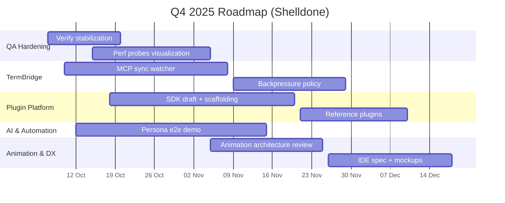

# Shelldone Roadmap — Q4 2025

> Версия: 2025‑10‑07 · Ответственный: imagray `<magraytlinov@gmail.com>`

## Видение
Сделать Shelldone эталонной терминальной платформой: высокая производительность, богатый UX, интеграция с AI и плагины уровня IDE.

## Основные фазы
1. **Codebase Hardening** — довести линтеры/тесты/перф до зелёного состояния на всех платформах (Due 2025‑10‑31; Owner: imagray · Support: QA Guild).
2. **Plugin Architecture** — подготовить SDK, примеры и процесс публикации (Due 2025‑11‑30; Owner: imagray · Support: Plugin Council).
3. **AI & Automation** — завершить MCP мост, политики и UX согласования действий (Due 2025‑11‑15; Owner: imagray · Support: Automation Guild).
4. **Animation & Visuals** — построить новый render loop и эффекты (Discovery 2025‑11‑10; Delivery 2025‑12‑20; Owner: imagray · Support: Experience Guild).
5. **IDE & DX** — файловый менеджер, LSP/DAP интеграция, улучшение tooling (Discovery 2025‑10‑25; Draft 2025‑12‑05; Owner: imagray · Support: DX Chapter).

## Текущий снимок
- Статусы задач — см. `docs/tasks.yaml` и `docs/status.md`.
- Архитектура — `docs/architecture/manifest.md`.
- Сводный MVP — `docs/ROADMAP/MVP.md` (приёмочные критерии и матрица проверок).
- Большинство TermBridge и QA задач помечены как «Готово»/«В процессе», остальные эпики ещё не стартовали.

## OKR на квартал
| Objective | Key Result | Baseline (2025‑10‑07) | Target | Owner | Evidence |
| --- | --- | --- | --- | --- | --- |
| TermBridge orchestration устойчива на всех платформах | Тест `termbridge_matrix` проходит ≤15 мин на macOS/Windows/Linux | 27 мин суммарно | ≤12 мин | imagray (support: TermBridge Guild) | CI `termbridge-matrix` |
| QA пайплайн фиксирует регрессии до merge | `python3 scripts/verify.py --mode full` покрывает ≥95 % diff | 88 % | ≥95 % | imagray (support: QA Guild) | `reports/verify.json`, diff-cover |
| Plugin SDK готов к preview | Draft API + 2 примера проходят RFT | Нет | Draft API + `cargo check` + doc tests | imagray (support: Plugin Council) | `plugins/examples/*`, doc tests |
| MCP сценарий e2e без ручного вмешательства | Playbook demo (agent plan → deploy) завершается ≤5 мин | Incomplete | Демо проходит, лог `agent.exec` error rate <1 % | imagray (support: Automation Guild) | MCP demo log |
| Animation perf в бюджете | Render loop bench p95 ≤16 ms на reference ноутбуке | Нет | Проба `scripts/perf/animation_loop.json` ≤16 ms | imagray (support: Experience Guild) | Perf artifacts |

## Мерная дорожка (Q4)

## Цели на квартал
| Направление | Цель | Статус |
| --- | --- | --- |
| TermBridge | MCP sync watcher — e2e покрытие и UI source-индикация готовы, осталось backpressure | В процессе (бета) |
| QA | Довести perf probes + визуализацию, стабилизировать verify | В процессе |
| Plugin Platform | Подготовить SDK draft, собрать примеры | Не готово |
| Animation Engine | Определить архитектуру и бюджеты | Не готово |
| IDE/DX | Специфицировать файл-менеджер и state sync | Не готово |
| Resilience | Проработать state persistence, security hardening | Не готово |

## KPI
- TTI ≤ 20 мс, tab switch ≤ 80 мс (см. perf budget).
- Telemetry покрывает key метрики (TermBridge, agentd).
- Минимум 3 демонстрационных плагина и 5 эффектов к релизу.
- MCP сценарий end-to-end (playbook → deploy) выполняется без ручных шагов.

## Контроль
- Состояние задач обновляется вручную (см. `docs/governance/status-updates.md`).
- Перед релизом формируется отчёт: `docs/status.md` + актуальный snapshot perf/telemetry.

## Ready-for-Test (RFT) чек-лист
| Scope | Обязательные проверки | Условия прохождения | Отчёт |
| --- | --- | --- | --- |
| TermBridge | `cargo test -p shelldone-agentd termbridge`, `termbridge_matrix` | Все платформы, время ≤ целевого лимита, 0 policy denials | `.github/workflows/termbridge_matrix.yml` |
| QA Hardening | `python3 scripts/verify.py --mode full`, `make review` | Diff-cover ≥95 %, perf пробы без деградации >5 % | `reports/verify.json`, `reports/perf/metrics.prom` |
| Plugin SDK | `cargo check -p shelldone-plugin-sdk`, `cargo fmt --check`, doctest примеров | 0 warning’ов, примеры собираются | `plugins/examples/README.md` |
| MCP Automation | `VERIFY_MODE=prepush make verify`, e2e playbook run | Error rate <1 %, трассировка содержит `agent.exec` успехи | трассировки присутствуют |
| Animation Engine | `scripts/perf/animation_loop.json`, визуальная регрессия | p95 ≤16 ms, нет критических reg-test diff | `artifacts/perf/animation/*.json` |

> `make review` выполняет: `cargo +nightly fmt --all -- --check`, `cargo clippy --workspace --all-targets -- -D warnings`, `cargo nextest run`, `cargo test -p shelldone-agentd --tests -- --nocapture`, `cargo test -p shelldone-agentd --test e2e_ack`, pytest (если доступен), `VERIFY_MODE=fast scripts/verify.sh`, `python3 scripts/check_duplication.py`, `cargo clippy --workspace --all-targets -- -W clippy::cyclomatic_complexity -W clippy::cognitive_complexity -D warnings`, `python3 scripts/check_contracts.py`, `python3 scripts/generate_sbom.py`.

## Epic Map
| Epic ID | Status       | Scope                                                      |
| ---     | ---          | ---                                                        |
| epic-termbridge | in_progress | shelldone-agentd/src/app/termbridge, scripts/tests/termbridge_matrix.py |

## Task Table
| Task ID | Epic            | Type | Size | Status |
| ---     | ---             | ---  | ---: | ---    |
| task-termbridge-matrix | epic-termbridge | test | 8    | planned  |
| task-termbridge-discovery-mcp-sync | epic-termbridge | feature | 5 | in_progress |

## Риски и 대응
| Риск | Вероятность | Импакт | План смягчения | Триггер |
| --- | --- | --- | --- | --- |
| MCP sync требует доп. API от внешних команд | Средняя | Высокий | Забронировать интерфейс freeze на 2025‑10‑15, подготовить fallback polling | Нет API до 2025‑10‑18 |
| k6 пробы перегружают CI | Высокая | Средний | Запускати пробы nightly + loopback в PR; настроить артефакт rotation | Build время >25 мин |
| Plugin SDK draft затягивается из-за комплаенса | Средняя | Высокий | Вовлечь security team, зафиксировать capability matrix, вынести спорные API под флаг | Нет draft к 2025‑11‑05 |
| Animation perf не впишется в бюджет GPU | Низкая | Высокий | Включить понижающие режимы, добавить ранний perf bench | Bench >16 ms на первом прогоне |
| IDE spec не получит согласование UX | Средняя | Средний | Провести двухшаговый ревью (DX/UX council), подготовить Figma | Нет согласования к 2025‑12‑01 |

## Зависимости и интеграции
| Deliverable | Внешняя зависимость | Контакт | SLA | План B |
| --- | --- | --- | --- | --- |
| MCP sync watcher | MCP API v1.4 | automation@shelldone.dev | Ответ ≤48 ч | Fallback pulling через existing bridge |
| TermBridge backpressure | WezTerm CLI ≥2025.09 build | wezterm@shelldone.dev | Release 1/месяц | Feature-flag `TERM_BRIDGE_BACKPRESSURE=off` |
| Plugin SDK | Cargo templates infra | toolchain@shelldone.dev | 2 дня на review | Ship только WASM preset |
| Animation perf bench | Reference hardware lab | infra@shelldone.dev | 72 ч слот | Synthetic bench через loopback |

### Следующие шаги
1. Отдельные дела TermBridge (MCP sync, backpressure) → фокус октября.
2. QA perf визуализация → собрать требования, подключить k6 скрипты.
3. Draft Plugin SDK → design review с Plugin Council.

Все изменения roadmap оформляйте PR’ом в этот файл и сопутствующие документы.
